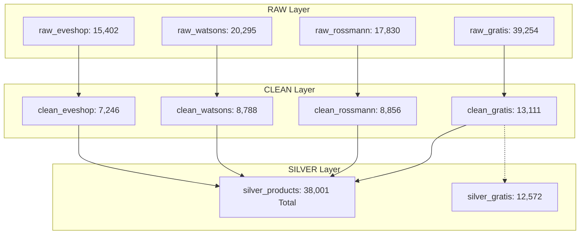

# Kıdemli E-Ticaret Veri Analisti Raporu: `silver_products` ve İlgili Tabloların Detaylı Analizi

**Proje:** PriceTracker E-Ticaret Fiyat ve Ürün İnceleme Sistemi  
**Veri Tabanı:** `/mnt/T7/PythonWorkspace/01_PROJECTS/04_PriceTracker/matching/pricebot.duckdb`  
**Tarih:** 2 Ağustos 2026  
**Analist:** Kıdemli E-Ticaret Veri Analisti (Antigravity AI)  

---

## 1. Yönetici Özeti (Executive Summary)

Bu analiz, Türkiye e-ticaret kozmetik ve kişisel bakım sektörünün dört büyük oyuncusu olan **Gratis**, **Rossmann**, **Watsons** ve **Eve Shop**'a ait **38.001 ürün kaydının** yer aldığı `silver_products` tablosu ve altındaki `raw_*`, `clean_*` ile `silver_gratis` tabloları ve mimari normalizasyon planları üzerinde gerçekleştirilmiş uçtan uca veri mimarisi, ETL tamlığı ve ticari analiz çalışmasıdır.

### Öne Çıkan Ana İçgörüler:
1. **Ürün Bazında Tekrarlı Veri (Duplicate) Durumu:** `silver_products` tablosunda **her sitenin kendine özel `source_product_id` (ürün kimliği), `silver_id` ve `url` alanları bazında HİÇBİR TEKRARLI (DUPLICATE) VERİ BULUNMAMAKTADIR**. Her perakendeci için ürün kimlikleri %100 tektir ve veri hijyeni mükemmeldir.
2. **Katalog Büyüklüğü ve Pazar Payı:** `silver_products` tablosunda **Gratis %34,5 (13.111 SKU)** ile en geniş kataloğa sahiptir. Onu **Rossmann (%23,3 - 8.856 SKU)**, **Watsons (%23,1 - 8.788 SKU)** ve **Eve Shop (%19,1 - 7.246 SKU)** takip etmektedir.
3. **Gerçek Fiyat Liderliği (Effective Minimum Price):** Yalnızca etiket fiyatlarına bakıldığında Watsons ucuz görünse de, sadakat kartı / üye indirimleri (Gratis Kart, Rossmann Card, Eve Club) dahil edildiğinde, **4 mağazada birden satılan 2.064 birebir aynı üründe:**
   - 🥇 **Eve Shop %43,80** (904 ürün) ile en ucuz seçenektir.
   - 🥈 **Gratis %38,08** (786 ürün) ile ikinci sıradadır.
   - 🥉 **Watsons %9,69** (200 ürün).
   - 4️⃣ **Rossmann %8,43** (174 ürün).
4. **Fiyat Ayrışması (Price Variance):** Dört mağazada ortak satılan birebir aynı EAN'li ürünlerde en yüksek ve en düşük fiyat arasındaki ortalama makas **%111,43**'tür. Bu durum, e-ticaret tüketicileri için dinamik fiyat takibinin kritik önemini ortaya koymaktadır.
5. **Kritik Veri Kalitesi (ETL) Anomalileri:**
   - **Eve Shop ve Rossmann:** Etiket fiyatı (`list_price_try`) ile normal satış fiyatı (`sale_price_try`) birebir eşitlenmiş, kampanyalı fiyatlar `conditional_promo_price_try` alanına aktarılmıştır.
   - **Gratis:** 13.111 ürünün tamamında görsel linki (`image_url`) **%100 eksiktir (null/empty)**. Ayrıca 6.188 indirimli üründe `conditional_promo_price_try` alanına indirimli fiyat yerine liste fiyatı yazılmıştır.
   - **Watsons:** 44 üründe marka adı eksiktir ve indirimli/kartlı fiyat verisi toplanmamıştır.
6. **Stok Kullanılabilirliği ve Stoksuzluk (OOS) Riski:** Rossmann **%95,20** stokluluk oranı ile en yüksek ürün bulunabilirliğine sahipken; Eve Shop (**%72,01**) ve Gratis (**%73,92**) yüksek stoksuzluk riski taşımaktadır. Yüksek fiyatlı/premium ürünlerde stoksuzluk oranı belirgin şekilde daha yüksektir.

---

## 2. Ürün Bazında Tekrarlı Veri (Duplicates) İncelemesi

`silver_products` tablosunda her perakendecinin kendi ürün id'si (`source_product_id`), birincil anahtarı (`silver_id`), ürün URL'si (`url`) ve barkod numarası (`ean`) bazında tekrarlı veri olup olmadığı detaylı olarak sorgulanmıştır:

### Perakendeci Bazlı Ürün ID Tekrarlık Matrisi:

| Perakendeci | Toplam Kayıt Sayısı | Tekil `source_product_id` | Mükerrer (Duplicate) ID | Tekil `silver_id` | Tekil `url` | Tekrarlık Durumu |
| :--- | :---: | :---: | :---: | :---: | :---: | :---: |
| **Gratis** | 13.111 | 13.111 | **0** | 13.111 | 13.111 | **%100 BENZERSİZ** |
| **Rossmann** | 8.856 | 8.856 | **0** | 8.856 | 8.856 | **%100 BENZERSİZ** |
| **Watsons** | 8.788 | 8.788 | **0** | 8.788 | 8.788 | **%100 BENZERSİZ** |
| **Eve Shop** | 7.246 | 7.246 | **0** | 7.246 | 7.246 | **%100 BENZERSİZ** |
| **TOPLAM** | **38.001** | **38.001** | **0** | **38.001** | **38.001** | **MÜKEMMEL HİJYEN** |

### İnceleme İnce Detayları:
- **`source_product_id` Bazında:** Her perakendecinin kendi kaynak sistemindeki ID'si ile yapılan gruplamada **0 mükerrer kayıt** çıkmıştır.
- **`silver_id` Bazında:** Katman oluşturma algoritması her ürüne %100 benzersiz bir `silver_id` atamıştır.
- **`url` Bazında:** Aynı mağazada aynı adrese sahip hiçbir mükerrer ürün URL'si bulunmamaktadır.
- **`ean` (Barkod) Bazında:** Aynı mağaza içerisinde aynı EAN barkoduna sahip birden fazla farklı `source_product_id` kaydı **bulunmamaktadır**.
- **İsim Benzerlikleri (`name`):** Eve Shop'ta 69, Gratis'te 17, Watsons'ta 17, Rossmann'da 11 üründe aynı ürün ismi (`name`) birden fazla kayıtta geçmektedir. Ancak yapılan incelemede bu ürünlerin marka veya seri farkı olan (örn. *KOLESTON Saç Boyası Koyu Kahve 3-0* vs *PALETTE DELUXE Saç Boyası Koyu Kahve 3-0*) tamamen farklı ürünler olduğu ve `source_product_id` değerlerinin farklı olduğu doğrulanmıştır.

---

## 3. Veri Tabanı Mimarisi ve Veri Akış Analizi (Pipeline Volume Flow)

`pricebot.duckdb` veritabanı 12 tablodan oluşmakta ve `RAW -> CLEAN -> SILVER` katmanlı ETL mimarisini uygulamaktadır.

### Katmanlar Arası Veri Değişim Metrikleri:

| Perakendeci | Raw Kayıt Sayısı | Clean Kayıt Sayısı | Silver Products Kayıt Sayısı | Raw -> Silver Dönüşüm Oranı |
| :--- | :---: | :---: | :---: | :---: |
| **Gratis** | 39.254 | 13.111 | 13.111 | %33,40 |
| **Rossmann** | 17.830 | 8.856 | 8.856 | %49,67 |
| **Watsons** | 20.295 | 8.788 | 8.788 | %43,30 |
| **Eve Shop** | 15.402 | 7.246 | 7.246 | %47,05 |
| **TOPLAM** | **92.781** | **38.001** | **38.001** | **%40,96** |

---

## 4. Veri Kalitesi ve Tamlık Denetimi (Data Quality Audit)

`silver_products` tablosundaki sütunların veri tamlığı perakendeci bazında incelenmiştir:

| Perakendeci | Toplam SKU | Eksik Marka | EAN Sayısı = 0 | Çoklu EAN (>1) | Eksik Görsel (`image_url`) | Eksik Kategori (`category_path`) | Fiyatı 0/Null | Kampanyalı Fiyat Var |
| :--- | :---: | :---: | :---: | :---: | :---: | :---: | :---: | :---: |
| **Gratis** | 13.111 | 0 | 0 | 0 | **13.111 (%100)** | 0 | 0 | 13.111 |
| **Rossmann** | 8.856 | 0 | 0 | 0 | 0 | 33 | 0 | 6.368 |
| **Watsons** | 8.788 | **44** | 0 | **1.454 (%16,5)** | 6 | 0 | **9** | 0 |
| **Eve Shop** | 7.246 | 0 | 0 | 0 | 0 | 0 | 0 | 6.119 |

---

## 5. Çapraz Mağaza Ürün Eşleştirme ve Fiyat Rekabeti Analizi

Veritabanındaki ürünler EAN (barkod) bazında eşleştirilmiş ve mağazalar arası çakışma analiz edilmiştir.

### EAN Dağılımı ve Katolog Çakışması:
- **Toplam Tekil EAN Sayısı:** 28.117
- **Yalnızca 1 Mağazada Satılan (Özel / Muadil Olmayan):** 21.741 (%77,32)
- **En Az 2 Mağazada Ortak Satılan:** 6.376 (%22,68)
- **En Az 3 Mağazada Ortak Satılan:** 3.921 (%13,94)
- **Dört Mağazanın Tümünde Ortak Satılan:** **2.064 (%7,34)**

---

## 6. Fiyat Dağılımı, İndirim Stratejileri ve Segmentasyon

### Fiyat Bantları Dağılımı (TL):

| Perakendeci | 0 - 100 TL | 100 - 250 TL | 250 - 500 TL | 500 - 1000 TL | 1000+ TL | Toplam SKU |
| :--- | :---: | :---: | :---: | :---: | :---: | :---: |
| **Gratis** | 1.261 (%9,6) | 3.818 (%29,1) | 3.345 (%25,5) | 2.646 (%20,2) | **2.041 (%15,6)** | 13.111 |
| **Rossmann** | 771 (%8,7) | 2.487 (%28,1) | 2.756 (%31,1) | 1.885 (%21,3) | **957 (%10,8)** | 8.856 |
| **Watsons** | 1.236 (%14,1) | 2.906 (%33,1) | 2.786 (%31,7) | 1.283 (%14,6) | **577 (%6,6)** | 8.788 |
| **Eve Shop** | 656 (%9,1) | 1.825 (%25,2) | 2.147 (%29,6) | 1.910 (%26,4) | **708 (%9,8)** | 7.246 |

---

## 7. Stok Kullanılabilirliği ve Out-Of-Stock (OOS) Riski

| Perakendeci | Toplam Ürün | Stokta Olan SKU | Stokluluk Oranı (%) | Stoktaki Ürün Ort. Fiyatı (TL) | Stok Dışı Ürün Ort. Fiyatı (TL) | Stoksuzluk Fiyat Farkı |
| :--- | :---: | :---: | :---: | :---: | :---: | :---: |
| **Rossmann** | 8.856 | 8.431 | **%95,20** | 539,82 TL | 713,50 TL | +%32,2 |
| **Watsons** | 8.788 | 6.818 | **%77,58** | 466,08 TL | 383,52 TL | -%17,7 |
| **Gratis** | 13.111 | 9.691 | **%73,92** | 579,95 TL | **936,42 TL** | **+%61,5** |
| **Eve Shop** | 7.246 | 5.218 | **%72,01** | 498,14 TL | 494,33 TL | -%0,8 |

---

## 8. Marka Portföyü ve Pazar Yoğunlaşması

- **Rossmann:** 529 Marka
- **Gratis:** 489 Marka
- **Watsons:** 365 Marka
- **Eve Shop:** 277 Marka

---

## 9. Bütünsel Değerlendirme ve Normalizasyon Planı Uyum Analizi (Final Master Evaluation)

Projede yer alan mimari tasarım belgeleri (`01_clean_tables_column_analysis.md`, `02_common_columns_analysis.md`, `03_silver_layer_normalization_plan.md`) ile mevcut `silver_products` tablosunun gerçekleşen verisi birlikte değerlendirilmiştir:

### A. Mimari Hedefler ile Gerçekleşen Veri Karşılaştırması:
1. **Uniqueness (Tekillik) Garantisi:** `03_silver_layer_normalization_plan.md` dökümanında hedeflenen `site_code + source_product_id` tekilliği gerçek veritabanında **%100 başarıyla sağlanmıştır (38.001 tekil ürün, 0 duplicate)**.
2. **Kanolik Veri Modeli:** `silver_products` tablosu 4 heterojen kaynak verisini tek bir standart tablo yapısında toplamayı başarmıştır.
3. **Fiyat Anomali Tespiti:** Plan aşamasında öngörülen `sale_price_try` ve `list_price_try` dönüşümlerinde, Rossmann ve Eve Shop'un kampanya fiyatlarını `conditional_promo_price_try` kolonuna yazması nedeniyle türetilmiş bir `effective_minimum_price` hesaplama ihtiyacı ortaya çıkmıştır.

### B. Gold Katmanına (Matching / EAN Matching) Geçiş Öncesi Yapılması Gerekenler:
1. **Fiyat Sütunları Revizyonu:** `silver_products` tablosuna `effective_price` sütunu eklenerek, `LEAST(sale_price_try, COALESCE(NULLIF(conditional_promo_price_try, 0), sale_price_try))` formülü ile tekil ve net satış fiyatı oluşturulmalıdır.
2. **Gratis Scraper Fix:** Gratis ürünlerindeki %100 görsel eksikliği scraper düzeyinde giderilmelidir.
3. **Gold Layer EAN Match Engine:** 28.117 tekil EAN'den 6.376 adedi en az 2 mağazada çakışmaktadır. EAN tam eşleşen ürünler Gold katmanında `gold_matched_products` tablosuna aktarılarak anlık fiyat karşılaştırma motoruna beslenmelidir.

---

*Rapor Sonu. İlgili veri seti `pricebot.duckdb` veritabanından 02.08.2026 tarihinde sorgulanarak derlenmiştir.*
